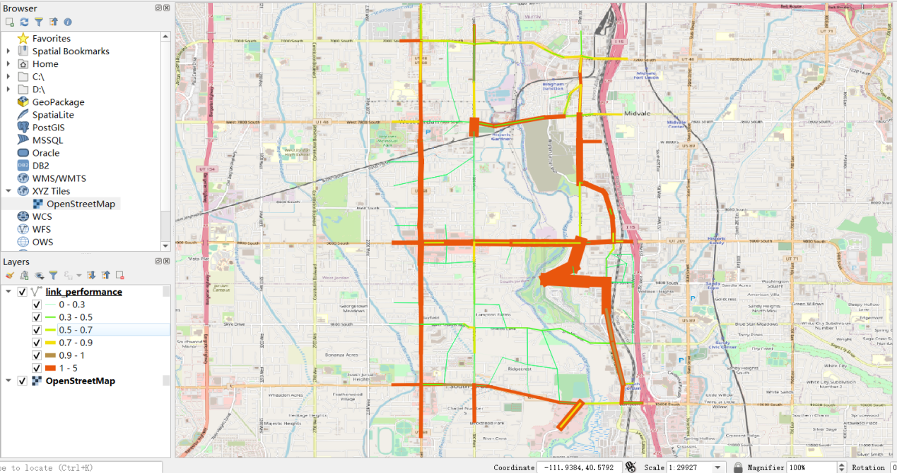

Working with GMNS Files in QGIS and NeXTA

Prepared by Dr. Cafer Avcı, Researcher & Engineer, NEVS, National Electric Vehicle Sweden
https://github.com/caferavci 

Dr. Xuesong (Simon) Zhou’ research group at Arizona State University

Contact: https://github.com/caferavci; xzhou74\@asu.edu

Table of Contents

[Part I: Basic Understanding of GMNS and visualization](#_Toc69942389)

>   [1. Introduction of GMNS, AMS, QGIS and NeXTA](#_Toc69942390)

>   [2. Import GMNS file with geometry field in QGIS](#_Toc69942391)

>   [3. Load XYZ Tiles in QGIS with background maps](#_Toc69942392)

>   [4. Visualize output file link_performance.csv in QGIS](#_Toc69942393)

>   [5. View/edit GMNS network in NeXTA](#_Toc69942394)

>   [6. Load GMNS network with background image in NeXTA through the help of
>   QGIS](#_Toc69942395)

[Part II: Advanced Topics: Create GMNS Networks](#_Toc69942396)

>   [7. Create a GMNS Network in NeXTA without background image](#_Toc69942397)

>   [8. Create a Network in NeXTA from the background map image](#_Toc69942398)

>   [9. Conversion between SHAPE file and CSV file](#_Toc69942399)

>   [10. How to use NEXTA to visualize the trajectory](#_Toc69942400)

# Part I: Basic Understanding of GMNS and visualization

## 1. Introduction of GMNS, AMS, QGIS and NeXTA

**What is GMNS?**

General Travel Network Format Specification is a product of Zephyr Foundation,
which aims to advance the field through flexible and efficient support,
education, guidance, encouragement, and incubation.
<https://zephyrtransport.org/projects/2-network-standard-and-tools/>

**What is AMS?**

As stated in FHWA website,
<https://cms7.fhwa.dot.gov/research/operations/analysis-modeling-simulation/analysis-modeling-simulation-overview>,
FHWA and its State and local agency partners have relied on analysis, modeling,
and simulation (AMS) to support investment decisions for the transportation
system. As the transportation system environment grows in complexity, increasing
pressure is placed on agencies to identify more innovative and efficient
solutions to a wide range of issues. These solutions include leveraging emerging
technologies, data sources, and alternative (non-traditional) strategies. AMS
tools will continue to play a critical role in evaluating these solutions.

**What is QGIS?**

QGIS is a free and open-source cross-platform desktop geographic information
system (GIS) application that supports viewing, editing, and analysis of
geospatial data.

QGIS functions as geographic information system (GIS) software, allowing users
to analyze and edit spatial information, in addition to composing and exporting
graphical maps.

QGIS supports both [raster](https://en.wikipedia.org/wiki/Raster_graphics) and
[vector](https://en.wikipedia.org/wiki/Vector_graphics) layers; vector data is
stored as either point, line, or
[polygon](https://en.wikipedia.org/wiki/Polygon_(computer_graphics)) features.
Multiple formats of raster images are supported, and the software can
georeference images.

**Source:** <https://en.wikipedia.org/wiki/QGIS>

**What is NEXTA?**

NeXTA: Network explorer for Traffic Analysis

In general, the software suite of NeXTA aims to:

(1) Provide an open-source code base to enable transportation researchers and
software developers to expand its range of capabilities to various traffic
management application.

(2) Present results to other users by visualizing **time-varying traffic flow
dynamics** and traveler route choice behavior in an integrated environment.

(3) Provide a free, educational tool for students to understand the complex
decision-making process in **transportation planning and optimization**
processes

(4) By managing GMNS data sets in both QGIS and NeXTA platforms, users can
visualize the background GIS map for a GMNS network, in a broader spatial
context, while NeXTA can provide time-dependent link performance visualization,
path-level and agent-level analysis, and time-dependent agent trajectory
visualization.

This document describes the process of obtaining [node.csv, link.csv, etc]
GMNS-compatible files for use in QGIS from an OSM network and how to display
GMNS file including node.csv, link.csv, timing.csv, agent.csv and
link_performance.csv in NeXTA.

## 2. Import GMNS file with geometry field in QGIS

Open GMNS node.csv and link.csv in Excel to verify the existence of the geometry
field.

Open QGIS and click on menu Layer-\>Add Layer-\>Add Delimited Text Layer. In the
following dialogue box, load GMNS node.csv and link.csv, and ensure WKT is
selected as geometry definition. Sample data set:
<https://github.com/asu-trans-ai-lab/NeXTA-QGIS_for_AMS_GMNS/tree/gh-pages/release>

## 3. Load XYZ Tiles in QGIS with background maps

Find XYZ Tiles and double-click OpenStreetMap on Browser panel. Please move the
background layer to the bottom to show the GMNS network.

Refence:
<https://gis.stackexchange.com/questions/20191/adding-basemaps-from-google-or-bing-in-qgis>

## 4. Visualize output file link.csv in QGIS

The 'geometry' field can be obtained from link.csv file. Then open this file in
the same way as above. (Layer-\>Add Layer-\>Add Delimited Text Layer)

Then you can show the width of links by field VOC with different color according
level of VOC in link layer. Right click on link layer and click on
properties-\>control feature-\>symbology

. Select Graduated-\>Value: VOC-\>MethodSize-\>Classes: -\>Classify and set the
value of the VOC level.

Note that, you can set color and width according to VOC field of each level.

Then you can display traffic assignment result with following picture.

## 5. View/edit GMNS network in NeXTA

Step 1: Download and Open NeXTA, Open the Tempe ASU Network

Before going into too much detail, first makes sure you’re using the most
up-to-date version of NeXTA, and open the Tempe ASU network.

Step 2: Open the Tempe ASU Network in NeXTA

In NeXTA, go to File -\> Open Traffic Network Project

In the Lesson 1, go to a select GMNS data folder, select the **node.csv** file,
and click **Open** (you need to ignore a number of warning messages reported by
NeXTA due to missing values)

NeXTA will open the network, and display the **File Loading Status window**. The
File Loading Status window displays information about the network currently open
in NeXTA, including information about the number of links, nodes, and
zones/activity locations in the network. This window can also be accessed by
going to **File -\> Check Data Loading Status**.

Step 3: Viewing/Editing Network Attributes in NeXTA

Network objects primarily consist of links, nodes, and zones. A driver starts
and ends their trip at a zone, traveling along road segments (links) between the
origin and destination. Links are connected together at nodes, where a node may
represent an intersection or a simple connection between two road segments.

Since vehicles only travel along links, passing nodes between their origin and
destination, trip details (such as travel time, distance, speed, etc.) are
heavily dependent upon link and node attributes. The most important link
attributes are typically link length, speed limit, number of lanes, and
capacity. Since nodes typically represent intersections, their important
attributes typically include node control type (signalized intersection,
stop-controlled intersection, no control, etc.) and traffic signal-related
attributes.

This section will quickly explain how to view and edit these network object
attributes.

**Step 3.1:** To quickly view most link or node attributes, simply select a link
or node using the Select Object tool, and look at the attributes in the GIS
Layer Panel in the bottom right corner of the screen.

**Step 3.2:** Select link layer as highlighted above.

**Step 3.3:** Select a link along Rural Road as shown below,

Check the Link Attribute display on the left hand size as shown below.

One can now select the node layer in the GIS Layer Panel,

**Step 3.4:** Select a node close to ASU campus,

Check the Node Attribute display on the left-hand size as shown below.

Alternatively, after selecting the link or node, **right-click** near the object
and select either Edit Link Properties or Node Properties. Selecting Edit Link
Properties opens the Link Properties dialog box, shown below. These dialog boxes
offer the ability to edit individual link and node attributes quickly and easily

-   simply replace the text/values in the appropriate field, select OK, and
    click the Save button

on the Tool Bar to save your changes to the network.

Step 4: Find short paths and use path analysis tool in NeXTA

The Path Analysis Tool is enabled by using the

button or going to MOE \> Path List Dialog, which is used to view link
attributes and path travel time statistics.

To use the tool, a path must first be selecting in the path layer as shown
below.

As a recap, this is accomplished by right-clicking the mouse at the origin node
for the path, selecting “Direction from Here”, and then right-clicking again at
the destination, selecting “Direction to Here”. The path is chosen automatically
based on the shortest path between the two points.

Selecting the

button opens the Path Information window, as shown in the example below. Similar
to the Link Information window, this tool shows link attributes for the links in
the path.

## 6. Load GMNS network with background image in NeXTA through the help of QGIS

Open base map in QGIS

Load GMNS network CSV file in QGIS

Arrange the order of QGIS layers so that the background images are shown below
the network layer.

Choose the proper area and export the map as image by clicking on menu
Project-\>Import/Export/Export Map to Image

Choose the proper network resolution, size of image, and please also select lock
the aspect ratio.

Save it as .bmp format image and the same folder of the STALite/NeXTA project.

Open node.csv within NeXTA directly, and the background map will be loaded
automatically.

# Part II: Advanced Topics: Create GMNS Networks

## 7. Create a GMNS Network in NeXTA without background image

Step 1: Open NeXTA

open NeXTA.exe

Step 2: Add new one-way links

Related toolbar buttons:

Step 2.1: Press the “Link”

toggle button.

Step 2.2: Press the left mouse on the location you want the link to start. This
could be on an existing node or where no node currently exists. Move the cursor
to the desired end of the link. Now release the left mouse on the location you
want the link to end. Again, this can be on a node or not. A link will be
created between these two locations, as shown below:

Step 3: Add multiple connected links

Related toolbar buttons:

,

Step 3.1: Press the “Link”

toggle button.

Step 3.2: Add an one-way link according to Step2.

Step 3.3: Press the left mouse on the location you want the link to start and
(carefully) release your mouse on the location you want the link to end (or on
an existing node if you want to connect to another link). A set of links will be
created between these two locations as, as shown below:

Step 3.4: To increase the overlapping range for detecting if links are
overlapping, you can click on the

toggle button continuously on the top of the GIS layer panel to enlarge the node
display area first. It is obvious that the link (1,2) is connected with
link(2,3), as shown below:

Adjust node size for display

Related toolbar buttons:

Press the

toggle button and adjust node size, as shown below:

Save GMNS data of node and link csv files

Related toolbar buttons:

Click the “save”

toggle button and to save the files of “node.csv” and “link.csv” to the local
project folder.

## 8. Conversion between SHAPE file and CSV file

Shape files are commonly used in different GIS and transportation planning
tools.

Two-way conversion allows users to easily use Excel to edit field names and
field values, e.g. using VLOOKUP functions to batch-process the values based on
link attributes, and then GIS to display the network geometry in a standard way.

>   The tools used in this user guide is summarized below.

>   Table Tools used in this user guide

| Number | Tool        | Address or format                                                                                                                                                                                                                                                                                                     |
|--------|-------------|-----------------------------------------------------------------------------------------------------------------------------------------------------------------------------------------------------------------------------------------------------------------------------------------------------------------------|
| 1      | Nexta       | \\releases                                                                                                                                                                                                                                                                                                            |
| 2      | Nexta_GIS   | \\tools\\GIS_shape_file_CSV_file_conversion\\NEXTA_GIS                                                                                                                                                                                                                                                                |
| 3      | Excel       |                                                                                                                                                                                                                                                                                                                       |
| 4      | QGIS/ArcGIS |                                                                                                                                                                                                                                                                                                                       |
| 5      | CSV files   | node.csv, link.csv                                                                                                                                                                                                                                                                                                    |
| 6      | Shape files | \*.dbf, \*.shp, \*.shx The shapefile format is a geospatial vector data format for geographic information system (GIS) software. It is developed and regulated by Esri as a mostly open specification for data interoperability among Esri and other GIS software products. https://en.m.wikipedia.org/wiki/Shapefile |

## 8.1 Step-by-step process for converting shape file to csv file

First, please download the NEXTA-GIS tool package, NEXTA_GIS.zip at

[/tools/GIS_shape_file_CSV_file_conversion](https://github.com/xzhou99/NeXTA-GMNS/tree/master/tools/GIS_shape_file_CSV_file_conversion)

Second, please unzip the package to find 1) NEXTA-GIS.exe executable and 2)
three sets of sample GIS files. Note that, there are a large number of DLL files
in the same folder, which are required as part of GIS SHAPE file reading
utility.

<https://en.wikipedia.org/wiki/QGIS>

<https://en.wikipedia.org/wiki/Shapefile>

**Step 1: Ensure GIS Shape file is readable.**

Open QGIS, go to menu-\>layer-\>add layer-\> add vector layer, and open a GIS
shp file, e.g. in data folder “1.Cube_sample_GIS_files”. For more information
about QGIS, one can refer to the user guide for QGIS at:
<https://docs.qgis.org/3.10/en/docs/user_manual/>

**Step 2:** Click on NEXTA-GIS.exe, Select menu ToolsShapefile to CSV two-way
converter,

Now one can find the dialog of Import/Export Data File. Click the “…” to choose
the Shape file, then click “Export to CSV File”.

**Step 3: Export Shape file to CSV file**: On the left side of Import/Export
Data File dialog, you can select a GIS Shape file (e.g., SLC_Network_Link.shp)
and then click on the button “Export to CSV File” to save the shape file data
into a new CSV file (e.g. link.csv).

As shown above, the sample file has 378 links. The user can check the
saved/converted csv file road link in Excel, where the true shape coordinate
information has been stored in the required field for representing “geometry” in
GMNS.

One can also use the similar step to convert a node shape file to node.csv.

**Step 4:** One can carefully change the field name for required fields in GMNS,
such as from_node_id or to_node_id in Excel. If the shape file does not consist
of the “from_node_id” and “to_node_id” messages, the csv file will not have this
filed. Note that, the node.csv file requires x_coord and y_coord fields, which
can be converted from the field of geometry, manually using the “text to column”
feature in Excel.

**Step 5: Convert two-way links to one-way links.**

In a common shape file for the link layer, a link can be coded as a two-way
link. Note that, GMNS requires one-way directional links.

1.  One can first add a field of “direction” with a value of 0 in link.csv, then
    use standard NEXTA tool to open the network, and then a two-way link will be
    automatically split to two one-way links in the interface, but without
    offset (so that two links are displayed as overlapping links).

2.  Then continuously click on the NEXTA toolbar highlighted in yellow below,
    increase and decrease link offset to make two related being displayed
    separately.

3.  The user can further save the project through menu file-\>save project, then
    the saved link file will have one-way links with offset geometry coordinates
    and the filed of “direction” = 1. This “direction” field is not required in
    GMNS but convenient for distinguishing two-way links and one-way links.

4.  In some cases, original fields such as AB_speed, or BA_speed are coded to
    represent different speed limits for different directions of a two-way link,
    the then user needs to manually transfer the information carefully.

5.  **Step-by-step process for converting csv file to shape file, using
    2-corridor example**

Now we use a simple two-corridor example (with 4 nodes and 4 links) to
illustrate the conversion process. For any CSV files with a “geometry” field
following the WKT format, one can seamlessly generate a shape file based on the
CSV files.

**Hints:** If the GMNS link CSV files do not have “geometry” field, you can use
NEXTA to first open the CSV file and save the project, to generate “geometry”
field automatically.

## 8.2 Step-by-step process for converting CSV file to SHAPE file

**Step 1: Open the CSV file in Excel to check the “geometry” field**

In this example, the “geometry” field in node.csv and link.csv is empty, so you
can turn to step 2 to generate “geometry” messages, if the CSV file has a
“geometry” field, you are able to turn to step 4.

**Step 2: Use standard NEXTA to generate “geometry” field in both node and link
files**

Use the standard NEXTA_GMNS executable, then click menu “File’’-\>Open Traffic
Network Project-\> choose node.csv, and finally click on the menu item “Save
Project’’ or the related toolbar button.

After this step, one can open the files node.csv and road_link.csv again, to
check the generated geometry field as shown below.

**Step 3: Use NeXTA_GIS to convert CSV file to SHAPE file**

Open the NeXTA_GIS executable. On the right side of the Import/Export Data File
dialog, please load a CSV file, choose the type (point/line/polygon) of geometry
field, and then click on the button “Export to GIS Shape File”.

>   Step 4: use QGIS to verify and display node.shp and link.shp.

## 10. How to use NEXTA to visualize the trajectory in space time diagram

NGSIM data set

<https://ops.fhwa.dot.gov/trafficanalysistools/ngsim.htm>

| Category     | File                        | Remark                                                         |
|--------------|-----------------------------|----------------------------------------------------------------|
| Main program | NEXTA_4_Trajectory.exe      | Open source NEXTA visualization tool                           |
| Input        | trajectories-0400-0415      | Sample file from NGSIM                                         |
| Input        | test_one_linetest_two_lines | Sample file from Pan Shang, for one vehicle\&\#39;s trajectory |
| Output       | Trajectory.csv              | Export to more user readable format                            |

**Format**

Each line is a record of trajectory

Please use space or comma to separate fields.

| No | Field Name           | Example 1     | Example 2     | Unit        | Remark                |
|----|----------------------|---------------|---------------|-------------|-----------------------|
| 1  | Vehicle_ID           | 1             | 1             |             |                       |
| 2  | Frame_ID             | 12            | 13            | 0.1 seconds |                       |
| 3  | Total_Frames         | 884           | 884           | 0.1 seconds |                       |
| 4  | Global_Time          | 1113433136100 | 1113433136200 | text        | you can put any value |
| 5  | Local_X              | 16.884        | 16.938        |             | not used              |
| 6  | Local_Y              | 48.213        | 49.463        | feet        |                       |
| 7  | Global_X             | 6042842.116   | 6042842.012   |             | not used              |
| 8  | Global_Y             | 2133117.662   | 2133118.909   |             | not used              |
| 9  | Vehicle_Length       | 14.3          | 14.3          | feet        |                       |
| 10 | Vehicle_Width        | 6.4           | 6.4           | feet        |                       |
| 11 | Vehicle_Class        | 2             | 2             |             | pax or truck          |
| 12 | Vehicle_Velocity     | 12.5          | 12.5          |             |                       |
| 13 | Vehicle_Acceleration | 0             | 0             |             |                       |
| 14 | Lane_Identification  | 2             | 2             |             | very important        |
| 15 | Preceding_Vehicle    | 0             | 0             |             |                       |
| 16 | Following_Vehicle    | 0             | 0             |             |                       |
| 17 | Spacing              | 0             | 0             |             |                       |
| 18 | Headway              | 0             | 0             |             |                       |

**Steps**

Step 1: Open the customized NEXTA from this folder.

https://github.com/asu-trans-ai-lab/NeXTA4GMNS/tree/gh-pages/2Dtrajectory_visulization

<https://github.com/asu-trans-ai-lab/NeXTA4GMNS/blob/gh-pages/2Dtrajectory_visulization/NeXTA4_Trajectory_package.zip>

Step 2: Select menu Tools-NGSIM Tools- **Active Space-Time View, and then load**
trajectory file for Visualizing trajectory data

Step 3:

Main functions

1.  **Display trajectories for each lane.**

In the menu Tools-NASIM Tools:

You can choose each lane number to see the trajectory;

1.  You can show Vehicle ID, and you can use mouse wheeler to zoom in and zoom
    out the display in the certain portion.

2.  You can use the mouse to click and draw a line in the space-time plate, and
    the NeXTA will automatically calculate the flow, density, and speed values
    across the line

1.  You can show cumulative flow count and density

You can show the space-time Density Contour

