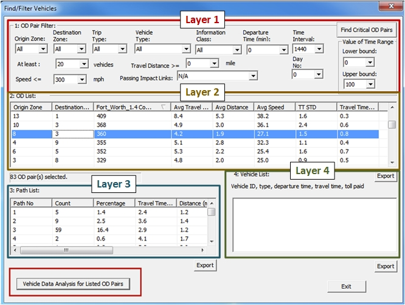

# Summary

Contemporary transportation modeling increasingly relies on large and heterogeneous data sources, including multi-resolution network topologies, time-varying traffic states, microscopic vehicle trajectories, and large-scale simulation outputs. Making sense of these data requires visualization tools that are both accurate and usable by researchers and practitioners.

NeXTA4GMNS (NeXTA) is an open-source platform for transportation network and trajectory visualization built around the General Modeling Network Specification (GMNS) standard [@GMNS2020]. NeXTA provides editable, multi-resolution node-link representations of transportation networks and supports analysis of link performance metrics such as travel time, traffic volume, and speed across time horizons. Beyond link-level metrics, NeXTA supports visualization and exploration of vehicle trajectories, tensor-based data structures for spatiotemporal processing, and shortest path computations. Unlike general-purpose GIS software, NeXTA is designed for scientific transportation modeling workflows, including trajectory analysis, OD trip and path exploration, and integration with simulation and assignment frameworks such as FHWA’s Analysis, Modeling, and Simulation (AMS) environment [@yelchuru2017analysis].

# Statement of Need

Transportation systems have become increasingly complex, and traditional data collection and analysis approaches often lack the spatial and temporal resolution required to understand modern travel dynamics and to support modeling, validation, and policy analysis [@Papageorgiou1991]. In parallel, the GMNS community has emphasized the importance of standardized network representations and visualization platforms capable of operating at the scale and complexity of real-world datasets [@GMNS2020].

NeXTA was developed to address these needs as a GMNS-compliant, open-source visualization platform for transportation network analysis and trajectory interpretation. Rather than focusing only on map rendering, NeXTA supports multi-resolution node-link representations and incorporates tensor-based data structures to enable analysis of spatiotemporal traffic patterns grounded in traffic flow theory [@Lighthill1955; @Richards1956].

Compared with general-purpose GIS tools such as QGIS, NeXTA offers built-in support for transportation-specific workflows, including microscopic trajectory analysis and direct integration with simulation outputs.

| Feature | NeXTA | QGIS |
|---|---|---|
| Network Representation | GMNS-compliant, node-link model | GIS shapefiles and layers |
| Trajectory Analysis | Built-in support for microscopic trajectory data (e.g., NGSIM) | Requires external plugins |
| Simulation Integration | Native support for DTALite [@Zhou2012DTALite] and SUMO [@Behrisch2011SUMO] outputs | Limited |
| Network Editing | Hierarchical, multi-resolution editing | Basic vector editing |
| Tensor-Based Modeling | Supported | Not available |
| Target Users | Transportation planners, researchers, educators | General GIS users |

High-resolution datasets such as the Next Generation Simulation (NGSIM) trajectories [@NGSIM2007] are difficult to analyze without specialized tools. NeXTA enables interactive exploration of such datasets, supporting both research and practice in transportation modeling and simulation.

# Software Description

## Core Features and Capabilities

**Multi-resolution network visualization and editing**

NeXTA supports seamless transitions between levels of detail, from link-level inspection for microsimulation to corridor- and zone-level views for planning. Networks can be edited and analyzed at multiple resolutions within a single interface.

**Tensor-based representation of trajectories**

Vehicle trajectories are represented as multi-dimensional tensors rather than simple point sequences. This enables compact storage, efficient manipulation, and advanced analytical operations for spatiotemporal filtering and aggregation.

**Cross-resolution and multi-view trajectory visualization**

NeXTA allows simultaneous visualization of individual vehicle trajectories and aggregate network performance, helping users relate microscopic behavior to macroscopic traffic phenomena [@Gazis2002; @Treiber2013].

**Integration with simulation frameworks**

NeXTA integrates with traffic simulation and assignment tools, supporting iterative visualization workflows aligned with FHWA guidance on integrated analysis and modeling [@nevers2013effective; @Papageorgiou2003].

## Multi-dimensional Matrix Representations

Agent movements are modeled using a trajectory tensor $X(a)$ that captures identity, origin-destination information, route choice, timing, and behavioral attributes. A baseline prior estimate $X_h(a)$ supports regularization when working with noisy or incomplete data.

Network-level conditions are captured by a measurement tensor $Y(i, j, t, m)$, which records link-level states such as flow, density, and speed. The relationship between individual trajectories and aggregate network conditions follows classical traffic assignment theory [@Wardrop1952; @Beckmann1956].

## Computational Graph for Traffic Modeling

NeXTA organizes OD-to-link relationships using a layered computational graph that supports forward and backward propagation for optimization-based calibration.

In Layer 1, OD flows $F_{OD}$ are mapped to path flows $f_P$ using an OD-to-path assignment matrix $B$. In Layer 2, path flows are aggregated to link flows $f_L$ using a path–link incidence matrix $A$. Layers 3 and 4 propagate link travel times back to path- and OD-level travel times. This structure supports gradient-based calibration and direct mapping between modeling constructs and visualization components.

| Modeling Element | NeXTA Visualization Feature |
|---|---|
| OD Flows ($F_{OD}$) | OD pair filtering and summaries |
| Path Flows ($f_P$) | Path and route analysis |
| Link Flows ($f_L$) | Link performance dashboards |
| Link Travel Times ($T_L$) | Dynamic heatmaps |
| Path Travel Times ($T_P$) | Aggregated trajectory profiles |
| OD Travel Times ($T_{OD}$) | OD travel-time matrices |
| Trajectory Tensor ($X(a)$) | Multi-dimensional agent tracking |

# Practical Applications and Examples

## OD-Based Trajectory Analysis

NeXTA provides OD pair and path-based filtering to analyze travel behavior across spatial and temporal dimensions. Users can filter trajectories by OD zones, departure time windows, and vehicle classes, then examine resulting impacts on link-level congestion and performance.

This workflow aligns with FHWA trajectory analysis practices [@FHWA2011] while embedding them in a GMNS-compliant, path-aware environment.

## High-Resolution Empirical Data Analysis

NeXTA supports detailed exploration of empirical trajectory datasets such as NGSIM. Figure \autoref{fig:NGSIMNeXTA} shows an example using the I-101 dataset with lane, speed, and spacing filters applied.

Trajectory-level visualization supports nuanced validation and calibration of microsimulation and behavioral models, complementing aggregate statistics. These capabilities are useful for applications such as traffic prediction [@KIM2020102786], connected and automated vehicle model calibration [@Shladover2012], and evaluation of traffic flow stability [@Talebpour2016].

## Demonstration and Learning Resources

NeXTA includes demonstration materials for researchers, practitioners, and educators. A walkthrough video illustrating network editing, OD filtering, and trajectory visualization is available at:
https://www.youtube.com/watch?v=example_NeXTA_demo

# Impact and Future Directions

NeXTA aims to make sophisticated transportation analysis accessible by combining rigorous modeling foundations with interactive visualization. By directly linking OD, path, and link modeling elements to visual representations, NeXTA supports calibration, validation, and communication with both technical and non-technical audiences.

Future directions include tighter integration of machine learning with traffic flow theory [@Zhang2011], expanded use of connected vehicle data for real-time analysis [@Talebpour2016], and enhanced support for multimodal transportation systems [@Cats2017]. NeXTA’s extensible architecture is designed to accommodate these developments while maintaining GMNS compliance and a focus on trajectory-centric analysis.

# Acknowledgements

The authors thank the anonymous reviewers for their constructive feedback. The authors also acknowledge the GMNS community for ongoing collaboration and the Federal Highway Administration for making the NGSIM dataset publicly available.
