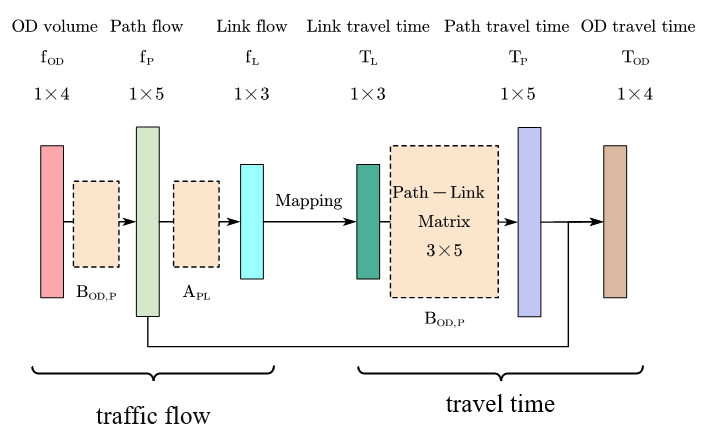
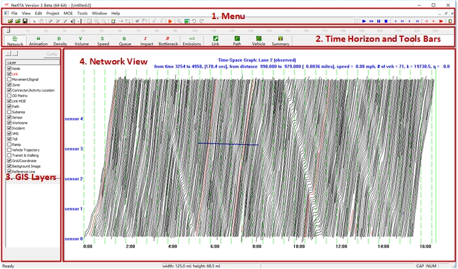

# Summary

Contemporary transportation modeling requires accurate and intuitive visualization tools to effectively interpret increasingly complex and high-dimensional data, including multi-resolution network topologies, time-varying traffic states, detailed vehicle trajectories, and large-scale simulation outputs. We present NeXTA4GMNS (NeXTA), an open-source platform designed specifically for network and trajectory visualization that fully embraces the General Modeling Network Specification (GMNS) standard [@GMNS2020]. NeXTA provides editable, multi-resolution node-link representations of transportation networks, enabling the analysis of link performance—such as travel time, traffic volume, and speed—across different time horizons. In addition to link-level metrics, it supports the visualization of vehicle trajectories, tensor-based data structures, and shortest path computations. Unlike general-purpose GIS tools, NeXTA is specifically designed for scientific transportation modeling, offering advanced capabilities for trajectory analysis, origin-destination trip and path exploration, and seamless integration with simulation frameworks such as FHWA’s AMS and dynamic traffic assignment (DTA) models [@yelchuru2017analysis].

# Statement of Need

Transportation systems have become increasingly complex in recent decades, making traditional methods for analyzing traffic flow—such as manual counts, loop detectors, and periodic surveys—insufficient for capturing the dynamic behavior of modern travel patterns [@Papageorgiou1991]. These methods often lack the spatial and temporal resolution needed to support detailed modeling, validation, and policy analysis in contemporary traffic systems.

Recognizing this limitation, GMNS community has highlighted the need for standardized network representations, along with visualization platforms that can support the scale and complexity of real-world datasets [@GMNS2020]. Visualization tools that facilitate the integration of network topology, traffic dynamics, and simulation outputs are especially critical.

NeXTA was developed in response to these needs. It is a GMNS-compliant, open-source visualization platform designed for transportation network analysis and trajectory data interpretation. Rather than focusing solely on map rendering, NeXTA supports multi-resolution node-link representations and incorporates tensor-based data structures to facilitate the analysis of spatiotemporal traffic patterns grounded in established traffic flow theory [@Lighthill1955; @Richards1956].

| Feature | NeXTA | QGIS |
|---|---|---|
| Network Representation | GMNS-compliant, node-link model | GIS shapefiles and layers |
| Trajectory Analysis | Built-in support for microscopic trajectory data (e.g., NGSIM) | Requires external plugins and preprocessing |
| Traffic Simulation Integration | Native support for simulation outputs (e.g., DTALite [@Zhou2012DTALite], SUMO (with post-processing) [@Behrisch2011SUMO]) | Limited support; not transportation-specific |
| Network Editing | Editable, hierarchical, and multi-resolution network views | Basic vector layer editing, not traffic-centric |
| Tensor-Based Modeling | Supports tensor structures for trajectory processing | Not available |
| Usability for Transportation Practitioners | Tailored for planners, researchers, and educators in traffic modeling | General-purpose GIS users |

Its utility lies in enabling users to explore traffic dynamics, examine vehicle trajectories, and modify network structures for simulation input or scenario testing. Compared to general-purpose GIS tools, NeXTA offers built-in support for transportation-specific tasks such as interpreting outputs from microscopic simulation models and editing hierarchical transportation networks.

Datasets such as the Next Generation Simulation (NGSIM) [@NGSIM2007] provide detailed vehicle trajectories that can be difficult to analyze without specialized tools. NeXTA helps bridge this gap by enabling interactive visualization and analysis of such high-resolution data, supporting both research and practice in transportation modeling and simulation.

# Software Description

## Core Features and Capabilities

### Multi-resolution network visualization and editing

One of NeXTA's most powerful features is its support for seamless transitions between different levels of detail. The framework handles everything from detailed lane-level analysis to broad corridor-level planning perspectives. Users can edit and analyze networks at the link level for microsimulation work, aggregate up to path-level analysis for route choice studies, or zoom out to zonal-level analysis for strategic planning—all within the same interface.

### Tensor-based representation of trajectories

Rather than treating vehicle trajectories as simple sequences of points, NeXTA represents them as multi-dimensional tensors that capture the full richness of movement data. This formulation enables more compact data storage, efficient data manipulation, and supports advanced analytical operations compared to traditional trajectory representations. It allows us to have more efficient storage, faster manipulation, and more sophisticated analysis capabilities than traditional approaches.

### Cross-resolution and multi-view trajectory visualization

NeXTA excels at showing individual vehicle trajectories unfold in real-time while simultaneously observing aggregate flow patterns across the entire network. This capability is crucial for understanding how microscopic driving behaviors aggregate into macroscopic traffic phenomena—a fundamental challenge in traffic flow theory [@Gazis2002; @Treiber2013].

### Integration with simulation frameworks

The platform seamlessly integrates with popular traffic simulation tools, supporting data exchange and synchronization. This integration philosophy aligns with FHWA's emphasis on effective integration of analysis, modeling, and simulation tools in transportation planning [@nevers2013effective]. This makes it particularly valuable for developing and testing advanced transportation network management strategies, where users need to quickly visualize the impacts of different control policies or infrastructure modifications [@Papageorgiou2003].

## Multi-dimensional Matrix Representations

At the heart of NeXTA's analytical power is its sophisticated mathematical representation of traffic data. We capture agent movements using a trajectory tensor $X(a)$ that includes comprehensive information about each vehicle or traveler:

- Unique agent identity and classification
- Origin-destination pair information
- Detailed route specifications and path choices
- Precise departure and arrival timing
- Vehicle characteristics and driver behavior parameters

To support robust optimization and calibration procedures, we also maintain a baseline prior estimate $X_h(a)$ that provides regularization when working with noisy or incomplete data—a common challenge when dealing with real-world trajectory datasets. Complementing this individual-level data, measurement tensor $Y(i, j, t, m)$ tracks the real-time state of network links, capturing flow rates, traffic density, average speeds, and other performance metrics. The connection between individual trajectories and aggregate network conditions is established through proportional mapping operators that have their roots in classical traffic assignment theory [@Wardrop1952; @Beckmann1956].

## Computational Graph for Traffic Modeling

The mathematical relationships underlying NeXTA draw from decades of traffic flow theory while incorporating modern computational approaches. One of NeXTA's most innovative features is its use of computational graphs to structure traffic modeling calculations, as illustrated in Figure \autoref{fig:CompGraph}. This approach enables efficient forward and backward propagation of gradients, supporting optimization-based calibration of travel times and flows.

The multi-layer structure transforms data systematically between different network elements. In **Layer 1**, we convert origin-destination flows $F_{OD}$ into path flows $f_P$ using an OD-to-Path assignment matrix $B$: $f_P = B \cdot F_{OD}$. This step captures how travelers choose among alternative routes, incorporating principles from discrete choice theory [@McFadden1974; @Ben-Akiva1985].

**Layer 2** then aggregates these path flows to produce link flows $f_L$ using a Path-to-Link incidence matrix $A$: $f_L = A \cdot f_P$. This is where individual route choices combine to create the traffic loads we observe on network links.

The reverse transformation happens in **Layer 3**, where link travel times $T_L$ are aggregated into path travel times $T_P$ using the transpose relationship: $T_P = A^\top \cdot T_L$. Finally, **Layer 4** maps these path travel times back to OD-level travel times using $T_{OD} = B \cdot T_P$.

This computational graph approach isn't just mathematically elegant—it's also highly practical. The structure naturally supports gradient-based optimization methods, making it much easier to calibrate complex traffic models against observed data.

The beauty of this layered approach becomes clear when you consider how it bridges abstract mathematical modeling with practical, user-friendly analysis tools. Every component of the computational graph shown in Figure \autoref{fig:CompGraph} maps directly to specific visualization features within NeXTA's interface, creating a seamless connection between theory and practice.

Table \autoref{tab:modeling_NeXTA} shows exactly how this mapping works. Elements like OD flows, path flows, and travel times aren't just mathematical abstractions—they become interactive visual components that help users understand their transportation systems. This connection between rigorous modeling and intuitive visualization is what makes NeXTA particularly effective for model calibration, validation, and communication with stakeholders who may not have deep technical backgrounds.

| Modeling Element | NeXTA Visualization Feature |
|---|---|
| OD Flows ($F_{OD}$) | Interactive OD pair filtering and summary statistics |
| Path Flows ($f_P$) | Comprehensive route/path analysis view |
| Link Flows ($f_L$) | Real-time link performance view (flow, speed, density) |
| Link Travel Times ($T_L$) | Dynamic heatmaps and link-level metrics dashboard |
| Path Travel Times ($T_P$) | Aggregated trajectory visualizations with time profiles |
| OD Travel Times ($T_{OD}$) | OD pair-level average travel time matrices |
| Tensor Representation ($X(a)$) | Multi-dimensional filtering and agent tracking |

: Modeling Elements and Visualization Support in NeXTA {#tab:modeling_NeXTA}

# Practical Applications and Examples

## OD-Based Trajectory Analysis

NeXTA offers a scientifically grounded environment for exploring transportation dynamics across spatial and temporal dimensions. At the core of this capability is the OD pair and path-based vehicle trajectory filtering interface, illustrated in Figure \autoref{fig:ODFiltering}. This tool allows users to dissect complex movement patterns by filtering trajectories based on origin-destination zones, departure time windows, and vehicle classifications—enabling focused analysis of freight activity, peak-hour congestion, or regional travel demand.

These filtering capabilities are tightly coupled with the platform’s multi-layer analytical framework. Filtering by OD zones corresponds to **Layer 1**, where flows are interpreted in terms of traveler route choices across alternative paths. Once trajectories are narrowed, users can transition to **Layer 2** analyses, examining how those path-based movements translate into link-level congestion and flow conditions. In this view, NeXTA allows users to visualize how route-level decisions—aggregated from large-scale vehicle trajectories—influence link performance metrics such as volume, speed, and travel time.

The tool also supports downstream analyses aligned with **Layers 3 and 4**, enabling users to assess how link-level conditions affect cumulative travel experiences across entire paths and back to OD-level performance summaries. This layered perspective ensures that filtered trajectories are not only visualized, but also quantitatively analyzed within a consistent system that spans OD flows, path assignments, and link-level dynamics.

Building on this structured framework, NeXTA's approach to route-based trajectory visualization aligns closely with established practices in the field—particularly those outlined in the FHWA's comprehensive *Trajectory Processor User's Guide* [@FHWA2011]. At the same time, NeXTA advances these methods by offering a standardized GMNS-compliant environment that integrates OD-based filtering with path-level analysis and link-level performance metrics.

## High-Resolution Empirical Data Analysis

Figure \autoref{fig:NGSIMNeXTA} showcases NeXTA's capabilities when working with high-resolution empirical datasets. In this example, we're visualizing trajectories with the NGSIM I-101 dataset, focusing on Lane 2 with speed and spacing filters applied to extract vehicle behavior patterns within specific spatial and temporal constraints.

This type of detailed analysis opens up entirely new possibilities for understanding traffic flow phenomena. Users can study lane utilization patterns to optimize lane management strategies, identify stop-and-go wave propagation to understand congestion formation, and analyze acceleration profiles to calibrate car-following models. The visual rendering incorporates dynamic overlays—speed profiles, trajectory segment colors, density indicators—that make it much easier to spot important phenomena like shockwave formation, merging conflicts, or capacity bottlenecks.

This capability proves particularly valuable when you're trying to validate microsimulation results against observed data or calibrate model parameters based on real-world traffic dynamics. Traditional approaches to this kind of validation often rely on aggregate statistics that can mask important behavioral details. NeXTA's trajectory-level visualization allows for much more nuanced comparisons between observed and simulated behavior, making it an essential bridge between theoretical model development and practical deployment.

The integration with empirical datasets like NGSIM also supports more advanced applications, including the development of machine learning models for traffic prediction [@KIM2020102786], the calibration of emerging connected and automated vehicle models [@Shladover2012], and the validation of traffic flow theories under real-world conditions.

## Demonstration and Learning Resources

To help users get the most out of NeXTA's capabilities, we've developed comprehensive demonstration materials. A detailed walkthrough video is available on YouTube: https://www.youtube.com/watch?v=example_NeXTA_demo. This video provides guided instruction on NeXTA's core tools, including network editing workflows, OD filtering techniques, advanced trajectory visualization options, and tensor exploration features.

The demonstration materials are designed to serve multiple audiences: researchers learning to use NeXTA for their own work, practitioners implementing the tool in operational settings, and educators incorporating visualization into their transportation courses.

# Impact and Future Directions

NeXTA represents a significant step forward in making sophisticated transportation analysis accessible to a broader community of researchers and practitioners. By combining rigorous mathematical foundations with intuitive visualization interfaces, we've created a tool that bridges the gap between theoretical traffic modeling and practical transportation planning applications.

Looking ahead, we're excited about several emerging directions. The integration of machine learning approaches with traditional traffic flow theory offers promising opportunities for more accurate and robust transportation models [@Zhang2011]. The growing availability of connected vehicle data will create new possibilities for real-time network analysis and control [@Talebpour2016]. And the increasing emphasis on multimodal transportation systems will require more sophisticated tools for analyzing the interactions between different travel modes [@Cats2017].

We believe NeXTA's flexible, extensible architecture positions it well to support these evolving needs while maintaining its core strengths in visualization and analysis.

# Acknowledgements

The authors thank the anonymous reviewers for their thoughtful feedback, which significantly improved this paper. We're also grateful to the broader GMNS community for their ongoing support and valuable input throughout NeXTA's development. Special thanks to the Federal Highway Administration for making the NGSIM dataset publicly available, enabling much of the validation work presented here.
